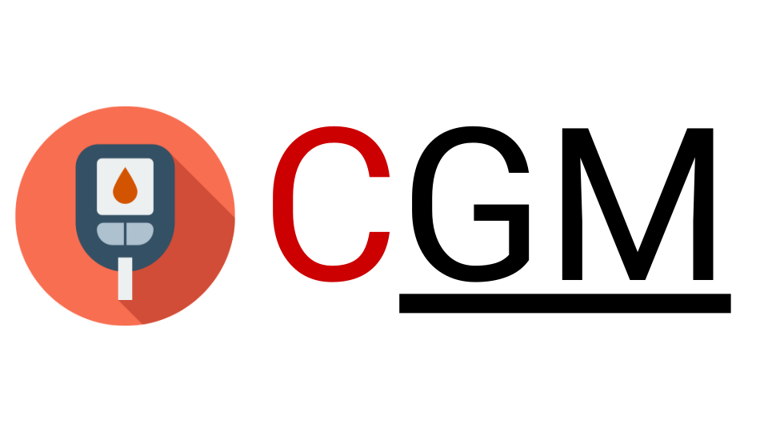
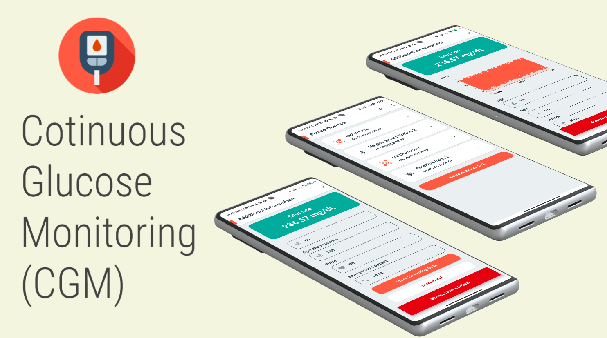

  

<h3 align="center">Android App for Real-Time Glucose Level Monitoring</h3>

 

  
  
  
  
  
   
  

 

  

## License

This work is licensed under [MIT License](https://github.com/atick-faisal/BLE-Starter-Android/blob/master/LICENSE).
